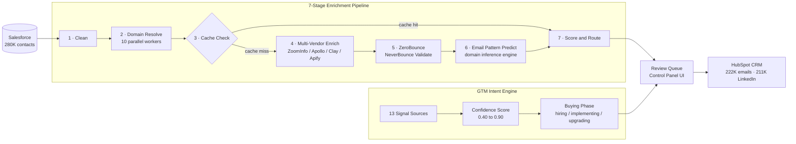

<div align="center">

[](https://git.io/typing-svg)

<p>
  
  &nbsp;&nbsp;
  
</p>

<p>
  <a href="https://www.linkedin.com/in/siddhartha-k/"></a>
  &nbsp;
  <a href="mailto:sidharthakothi@gmail.com"></a>
  &nbsp;
  <a href="https://github.com/siddhartha0810"></a>
</p>

<p>
  
  &nbsp;
  
</p>

</div>

---

## About Me

> *Building AI-powered GTM infrastructure from zero — no team, no playbook, just a production system that ships.*

I'm a **GTM Intelligence Engineer** with hands-on experience building AI-powered outbound and enrichment infrastructure from scratch. I design, ship, and operate production pipelines covering multi-source lead enrichment, custom email-pattern prediction, CRM migration, and deliverability validation — at **280K-record scale**.

At **Inoapps Ltd**, I built and run a full B2B GTM data platform solo: identified bottlenecks by talking directly to sales reps, decided what to build, and shipped it end-to-end. That includes a multi-vendor enrichment pipeline routing across ZoomInfo, Apollo, Apify, and Clay; a custom email-pattern prediction engine; and a 280K-contact Salesforce → PostgreSQL → HubSpot migration that produced **~222K validated emails** and **~211K LinkedIn-enriched contacts** with zero manual intervention.

I'm an active daily user of Claude, GPT-4o, Apollo, Clay, ZoomInfo, HubSpot, and Salesforce. My open-source project — the **GTM Intelligence Engine** — is a standalone intent detection and enrichment platform built publicly: 13-source signal scraping, confidence scoring, 7-stage enrichment pipeline, and automated HubSpot push. I thrive in zero-to-one environments with no playbook.

**Open To:** `GTM Engineer` &nbsp;·&nbsp; `RevOps Engineer` &nbsp;·&nbsp; `Sales Intelligence Engineer` &nbsp;·&nbsp; `Growth Engineer` &nbsp;·&nbsp; `Revenue Intelligence Lead`

---

## Tech Stack

**Languages**

<p>
  
</p>

**Frontend & Dashboards**

<p>
  
</p>

**Backend & Databases**

<p>
  
</p>

**Cloud, DevOps & Tooling**

<p>
  
</p>

**GTM, Enrichment & AI Stack**

<p>
  
  &nbsp;
  
  &nbsp;
  
  &nbsp;
  
  &nbsp;
  
  &nbsp;
  
  &nbsp;
  
  &nbsp;
  
  &nbsp;
  
  &nbsp;
  
  &nbsp;
  
  &nbsp;
  
</p>

---

## GTM Intelligence & AI Expertise

| Domain | Proficiency | Details |
|--------|:-----------:|---------|
| **Multi-Source Lead Enrichment** | `Expert` | Vendor routing across ZoomInfo, Apollo, Apify, and Clay based on live coverage confidence with checkpoint/resume logic |
| **Email Pattern Prediction** | `Expert` | Custom engine with domain resolution and override logic — generates verified email hypotheses for contacts no vendor has on file |
| **Email Deliverability Validation** | `Expert` | Multi-stage pipelines with ZeroBounce and NeverBounce — 222K validated emails from 280K input at Inoapps |
| **CRM Migration at Scale** | `Expert` | End-to-end 280K-contact Salesforce → PostgreSQL → HubSpot migration with zero manual intervention |
| **Intent Signal Detection** | `Advanced` | 13-source Oracle intent signal network — job boards, news APIs, Oracle ecosystem, partner case studies |
| **ICP Targeting & Segmentation** | `Expert` | Clay + Apollo + ZoomInfo workflows filtering by job title, firmographics, and buying signals for outbound sequences |
| **LLM Agent Workflows** | `Advanced` | Claude, GPT-4o, Gemini for prospect research and content generation; Copilot Studio + MCP integrations |
| **Deduplication & Reconciliation** | `Expert` | Cross-vendor dedup, ownership conflict resolution, single source of truth across CRM and enrichment vendors |
| **Reporting & Analytics Pipelines** | `Advanced` | Power BI (DAX/Power Query), AWS Athena/S3, KPI frameworks — replaced manual reporting at Qualcomm and Intel |
| **RevOps Data Modeling** | `Advanced` | PostgreSQL schema design: enrichment_cache TTL, domain_knowledge, email_patterns, scan state, audit logs |

---

## Featured Projects

<details>
<summary><b>&nbsp;GTM Intelligence Engine — AI-Powered Oracle/JDE Sales Intelligence Platform</b></summary>

<br/>

> An enterprise-grade B2B sales intelligence platform that autonomously identifies companies actively buying, implementing, or upgrading Oracle ERP products — then enriches, validates, and delivers verified decision-maker contacts to HubSpot CRM through a production-ready React dashboard.

| Attribute | Details |
|-----------|---------|
| **Stack** | Python 3.13 · FastAPI · PostgreSQL 15 · React 18 · TypeScript · Vite · JWT Auth |
| **Scale** | 13 signal sources · 10 parallel enrichment workers · 10 database tables · 30-day result cache |
| **Intelligence** | Confidence scoring 0.40–0.90 · Local LLM entity extraction · 5 buying-phase classifiers · staffing firm filter |
| **Integrations** | Apollo.io (contact discovery) · ZeroBounce (email validation) · HubSpot (CRM sync) · Ollama (local LLM) |
| **Security** | JWT authentication · 4-tier RBAC (owner/admin/viewer/recruitment) · fully parameterized SQL |
| **Architecture** | Signal Detection → PostgreSQL ← 7-Stage Enrichment → FastAPI → React Dashboard → HubSpot |
| **Impact** | Eliminates manual top-of-funnel prospecting for Oracle/JDE enterprise sales cycles |
| **Repository** | [github.com/siddhartha0810/gtm-intelligence-engine](https://github.com/siddhartha0810/gtm-intelligence-engine) |

**System Design:** Three integrated layers power the platform. The **Oracle Intent Engine** monitors 13 specialized sources — Indeed, ZipRecruiter, Adzuna, TotalJobs, CWJobs, Oracle.com, Oracle Community, Oracle Events, NewsAPI, Bing News, SI partner case studies, company pages, and home builder directories — assigning confidence scores from 0.40 to 0.90. The **Lead Enrichment Engine** runs a 7-stage pipeline (clean → domain resolve → enrich → validate → email predict → re-validate → score) with multi-layer lookup that protects API budgets while maximizing coverage. The **React Dashboard** gives sales teams full control: Engine Control, Review Queue, HubSpot Sync, Reporting, and role-scoped JWT auth — built entirely by one engineer, shipped end-to-end.

</details>

---

## Experience

**AI & Data Associate**
*Inoapps Ltd · Houston, TX · Mar 2026 – Present*

Built and operate a full B2B GTM data platform from scratch — no team, no instructions, no prior system. Identified manual bottlenecks by talking directly to sales and business reps, decided what to build, and shipped it end-to-end.

- Designed and shipped a multi-source lead enrichment pipeline in Python with checkpoint/resume logic, orchestrating vendor routing across ZoomInfo, Apollo, Apify, and Clay based on live coverage confidence
- Engineered a custom email-pattern prediction engine with domain resolution and override logic to generate verified email hypotheses for contacts no vendor has on file
- Ran a 280,000-contact Salesforce → PostgreSQL → HubSpot migration end-to-end: multi-stage validation via ZeroBounce and NeverBounce produced ~222K validated emails and ~211K enriched with LinkedIn URLs, zero manual intervention
- Architected deduplication and reconciliation logic across CRM and enrichment vendors to maintain a single source of truth, including ownership conflict and duplicate resolution
- Developed internal review/control tooling (queue, audit log, control panel UI) so non-technical sales and ops teams could monitor and approve automated pipeline outputs without touching code
- Deployed Clay alongside Apollo and ZoomInfo to automate account research workflows, filtering target accounts by job title and firmographics to build ICP-matched, segmented prospect lists
- Evaluated Claude, GPT-4o, and Gemini for LLM-powered prospect research; explored Copilot Studio and MCP for HubSpot–JIRA integration

`Python` `PostgreSQL` `Apollo.io` `ZoomInfo` `Clay` `Apify` `HubSpot` `Salesforce` `ZeroBounce` `NeverBounce` `FastAPI` `React` `LLM Workflows` `MCP`

---

**Business Analyst**
*Qualcomm · USA · Jan 2024 – Feb 2026*

Embedded with GTM and engineering teams to automate reporting pipelines, eliminate manual data work, and surface insights that drove outbound and marketing decisions.

- Partnered with GTM and marketing stakeholders to identify reporting bottlenecks, built automation business cases using SQL/Python analysis, and got them prioritised into the engineering backlog
- Automated KPI validation, reconciliation, and exception tracking in Python — eliminated recurring manual checks every reporting cycle
- Defined source-to-target mappings and validation logic for reporting pipelines, reducing data discrepancies by 25% across teams
- Replaced static weekly reporting with near real-time Power BI dashboards, giving GTM and marketing teams live pipeline and performance visibility
- Used Claude to draft requirements, generate documentation, and summarise stakeholder input — tightened turnaround on cross-functional deliverables

`Python` `SQL` `Power BI` `DAX` `Power Query` `AWS Athena` `AWS S3` `Claude` `KPI Frameworks` `Data Pipelines`

---

**IT Business Analyst**
*Intel · India · Jan 2022 – Jun 2023*

Automated operational data pipelines and built monitoring systems that gave non-technical stakeholders reliable, real-time visibility.

- Developed source-to-target mappings and reconciliation logic, resolving discrepancies between engineering and business metrics by 20%
- Implemented monitoring and alerting workflows that reduced mean time to detect anomalies before they hit downstream GTM processes
- Automated recurring operational reporting and validation using Python and SQL, eliminating 4–5 hours of manual weekly data-pull time per cycle

`Python` `SQL` `Data Pipelines` `Monitoring & Alerting` `Reconciliation Logic` `Operational Reporting`

---

## Impact & Scale

<div align="center">

| Metric | Achievement |
|:------:|-------------|
| **280,000** | Contacts migrated end-to-end: Salesforce → PostgreSQL → HubSpot, zero manual intervention |
| **~222,000** | Validated emails produced from 280K input via ZeroBounce + NeverBounce multi-stage pipeline |
| **~211,000** | Contacts enriched with LinkedIn URLs from the same 280K dataset |
| **25%** | Data discrepancy reduction across GTM and marketing reporting pipelines at Qualcomm |
| **20%** | Metric discrepancy resolution between engineering and business systems at Intel |
| **4–5 hrs/week** | Manual data-pull time eliminated per reporting cycle at Intel |
| **13** | Signal sources monitored in real-time by the GTM Intelligence Engine |
| **4** | Enrichment vendors orchestrated in live routing logic: ZoomInfo · Apollo · Apify · Clay |

</div>

---

## Achievements

<div align="center">

| Recognition | Details |
|:-----------:|---------|
| **Patent Inventor** | A Voice Alert Agricultural Monitoring System · NIT Calicut · IN 202441092935 |
| **280K CRM Migration** | Solo end-to-end Salesforce → PostgreSQL → HubSpot at production scale — zero manual intervention |
| **Custom Email Prediction Engine** | Domain-level email format inference for contacts no vendor has on file — built from scratch |
| **Multi-Vendor Enrichment Router** | Live coverage-confidence routing across ZoomInfo, Apollo, Apify, Clay — minimises cost, maximises yield |
| **Control Panel for Non-Technical Teams** | Built queue, audit log, and UI so sales and ops can approve pipeline outputs without touching code |
| **13-Source Intent Signal Network** | Real-time Oracle ERP buying intent detection across job boards, news APIs, Oracle ecosystem, partner sites |

</div>

---

## Certifications

**AWS**

<p>
  
</p>

**Microsoft**

<p>
  
</p>

**IBM**

<p>
  
</p>

**Patent**

<p>
  
</p>

---

## Coding Profiles

<div align="center">

<a href="https://leetcode.com/siddhartha0810">
  
</a>
&nbsp;
<a href="https://www.geeksforgeeks.org/user/siddhartha0810">
  
</a>
&nbsp;
<a href="https://www.hackerrank.com/siddhartha0810">
  
</a>
&nbsp;
<a href="https://www.codechef.com/users/siddhartha0810">
  
</a>

</div>

---

## Most Used Languages

<div align="center">


</div>

---

## GTM Pipeline Architecture

> The system I built and operate at Inoapps — from raw Salesforce export to verified HubSpot contacts at 280K scale.



---

## Current Focus

```yaml
current_focus:
  learning:
    - "LLM fine-tuning for sales intent classification and confidence scoring"
    - "Vector databases (pgvector) for semantic prospect and signal matching"
    - "AWS infrastructure for GTM platform multi-tenant deployment and scaling"

  building:
    - "GTM Intelligence Engine — intent detection, enrichment, validation, HubSpot push"
    - "Multi-vendor routing with live coverage confidence and API cost optimization"
    - "AI-powered outreach personalization using enriched company and contact context"

  exploring:
    - "MCP integrations for HubSpot-JIRA and cross-system CRM automation"
    - "Multimodal intent signals: G2 reviews, LinkedIn engagement, Bombora-style co-op data"
    - "Predictive pipeline scoring using gradient boosting on enriched GTM signal data"

  open_to:
    - "GTM Engineer · RevOps Engineer · Sales Intelligence Engineer"
    - "Growth Engineer · Revenue Intelligence Lead · Sales Technology Architect"
```

---

## Connect

<div align="center">

<a href="mailto:sidharthakothi@gmail.com">
  
</a>
&nbsp;
<a href="https://www.linkedin.com/in/siddhartha-k/">
  
</a>
&nbsp;
<a href="https://github.com/siddhartha0810">
  
</a>

</div>

---

<div align="center">

*"The best GTM engineers don't just operate the revenue stack — they architect it from first principles."*

</div>


